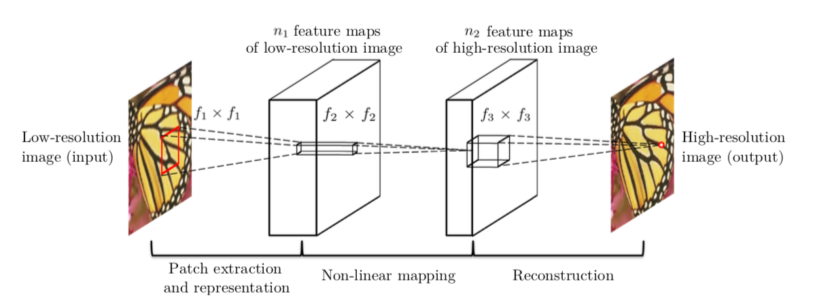
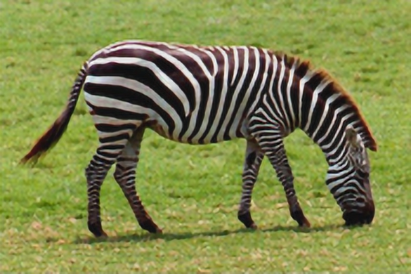

# SRCNN

This repository is implementation of the ["Image Super-Resolution Using Deep Convolutional Networks"](https://arxiv.org/abs/1501.00092).

<center></center>

## Differences from the original

- Added the zero-padding
- Used the Adam instead of the SGD
- Removed the weights initialization

## Requirements

- PyTorch 1.0.0
- Numpy 1.15.4
- Pillow 5.4.1
- h5py 2.8.0
- tqdm 4.30.0

## Train

The 91-image, Set5 dataset converted to HDF5 can be downloaded from the links below.

| Dataset | Scale | Type | Link |
|---------|-------|------|------|
| 91-image | 2 | Train | [Download](https://www.dropbox.com/s/2hsah93sxgegsry/91-image_x2.h5?dl=0) |
| 91-image | 3 | Train | [Download](https://www.dropbox.com/s/curldmdf11iqakd/91-image_x3.h5?dl=0) |
| 91-image | 4 | Train | [Download](https://www.dropbox.com/s/22afykv4amfxeio/91-image_x4.h5?dl=0) |
| Set5 | 2 | Eval | [Download](https://www.dropbox.com/s/r8qs6tp395hgh8g/Set5_x2.h5?dl=0) |
| Set5 | 3 | Eval | [Download](https://www.dropbox.com/s/58ywjac4te3kbqq/Set5_x3.h5?dl=0) |
| Set5 | 4 | Eval | [Download](https://www.dropbox.com/s/0rz86yn3nnrodlb/Set5_x4.h5?dl=0) |

Otherwise, you can use `prepare.py` to create custom dataset.

```bash
python train.py --train-file "BLAH_BLAH/91-image_x3.h5" \
                --eval-file "BLAH_BLAH/Set5_x3.h5" \
                --outputs-dir "BLAH_BLAH/outputs" \
                --scale 3 \
                --lr 1e-4 \
                --batch-size 16 \
                --num-epochs 400 \
                --num-workers 8 \
                --seed 123                
```

## Test

Pre-trained weights can be downloaded from the links below.

| Model | Scale | Link |
|-------|-------|------|
| 9-5-5 | 2 | [Download](https://www.dropbox.com/s/rxluu1y8ptjm4rn/srcnn_x2.pth?dl=0) |
| 9-5-5 | 3 | [Download](https://www.dropbox.com/s/zn4fdobm2kw0c58/srcnn_x3.pth?dl=0) |
| 9-5-5 | 4 | [Download](https://www.dropbox.com/s/pd5b2ketm0oamhj/srcnn_x4.pth?dl=0) |

The results are stored in the same path as the query image.

```bash
python test.py --weights-file "BLAH_BLAH/srcnn_x3.pth" \
               --image-file "data/butterfly_GT.bmp" \
               --scale 3
```

## Results

We used the network settings for experiments, i.e., <a href="https://www.codecogs.com/eqnedit.php?latex={&space;f&space;}_{&space;1&space;}=9,{&space;f&space;}_{&space;2&space;}=5,{&space;f&space;}_{&space;3&space;}=5,{&space;n&space;}_{&space;1&space;}=64,{&space;n&space;}_{&space;2&space;}=32,{&space;n&space;}_{&space;3&space;}=1" target="_blank"></a>.

PSNR was calculated on the Y channel.

### Set5

| Eval. Mat | Scale | SRCNN | SRCNN (Ours) |
|-----------|-------|-------|--------------|
| PSNR | 2 | 36.66 | 36.65 |
| PSNR | 3 | 32.75 | 33.29 |
| PSNR | 4 | 30.49 | 30.25 |

<table>
    <tr>
        <td><center>Original</center></td>
        <td><center>BICUBIC x3</center></td>
        <td><center>SRCNN x3 (27.53 dB)</center></td>
    </tr>
    <tr>
    	<td>
    		<center></center>
    	</td>
    	<td>
    		<center></center>
    	</td>
    	<td>
    		<center></center>
    	</td>
    </tr>
    <tr>
        <td><center>Original</center></td>
        <td><center>BICUBIC x3</center></td>
        <td><center>SRCNN x3 (29.30 dB)</center></td>
    </tr>
    <tr>
    	<td>
    		<center></center>
    	</td>
    	<td>
    		<center></center>
    	</td>
    	<td>
    		<center></center>
    	</td>
    </tr>
    <tr>
        <td><center>Original</center></td>
        <td><center>BICUBIC x3</center></td>
        <td><center>SRCNN x3 (28.58 dB)</center></td>
    </tr>
    <tr>
    	<td>
    		<center></center>
    	</td>
    	<td>
    		<center></center>
    	</td>
    	<td>
    		<center></center>
    	</td>
    </tr>
</table>
